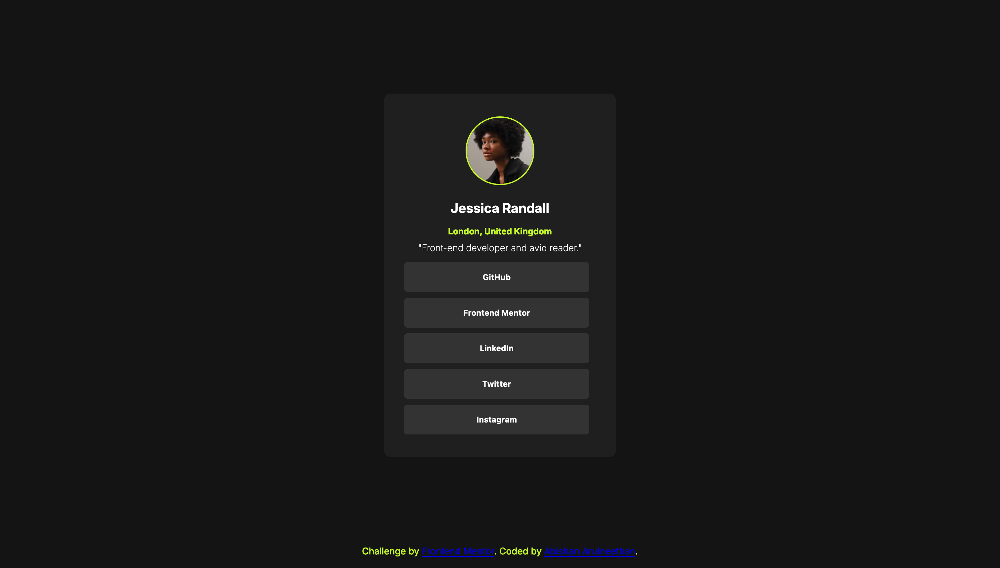
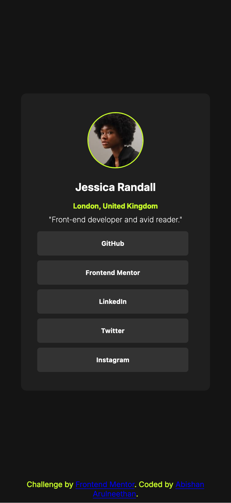

# Frontend Mentor - Recipe Page Solution

This repository contains my solution to the [Social links challenge on Frontend Mentor](https://www.frontendmentor.io/challenges/social-links-profile-UG32l9m6dQ). The challenge involves building a social links profile and making it look as close to the provided design as possible.

## Table of Contents

- [Overview](#overview)
  - [The Challenge](#the-challenge)
  - [Screenshots](#screenshots)
  - [Links](#links)
- [My Process](#my-process)
  - [Built With](#built-with)
- [Author](#author)

## Overview

This project called 'Social Links' involves building a social links profile and making it look as close to the provided design as possible. The goal is to practice your front-end development skills while exploring different tools and techniques. The design includes interactive elements like buttons and links, and you are required to implement hover and focus states for these elements to ensure a smooth and intuitive user experience.

### The Challenge

The goal was to create a responsive social links profile page that includes:

- A profile section with an avatar, name, and location
- A list of social media links presented as buttons
- An attractive layout for both web and mobile views, with appropriate hover and focus states for all interactive elements

You can find more details about the challenge [here](https://www.frontendmentor.io/challenges/social-links-profile-UG32l9m6dQ).

### Screenshots

#### Web View

#### Mobile View

### Links

- **Solution URL:** [GitHub Repository](https://github.com/Abishan13/fm-social-links)
- **Live Site URL:** [Live Demo](https://abishan13.github.io/fm-social-links/)

## My Process

1. **Planning and Structure:** I started by defining the semantic HTML structure, organizing the content into meaningful sections. This included using tags like `<header>`, `<main>`, `<section>`, and `<footer>` to create a clear and accessible layout.

2. **Styling and Design:** Once the HTML structure was in place, I focused on the CSS styling. I employed modern CSS techniques such as Flexbox and Grid to create a responsive design that works well on various devices. The design phase also involved choosing a color scheme, setting typography, and ensuring consistent spacing and alignment.

3. **Responsive Design:** Special attention was given to making the page responsive, ensuring that it provides a smooth user experience on both mobile and desktop devices. This involved media queries and flexible layouts that adapt to different screen sizes.

### Built With

- **Semantic HTML5 Markup:** For a clear and accessible structure.
- **CSS:** Including modern techniques like Flexbox and Grid for layout.

## Author

- **Website:** [Abishan Arulneethan](https://arulabishan.dev/)
- **Frontend Mentor:** [@Abishan13](https://www.frontendmentor.io/profile/Abishan13)
- **GitHub:** [@Abishan13](https://github.com/Abishan13)

Feel free to explore the project, and don't hesitate to reach out if you have any questions or feedback!
